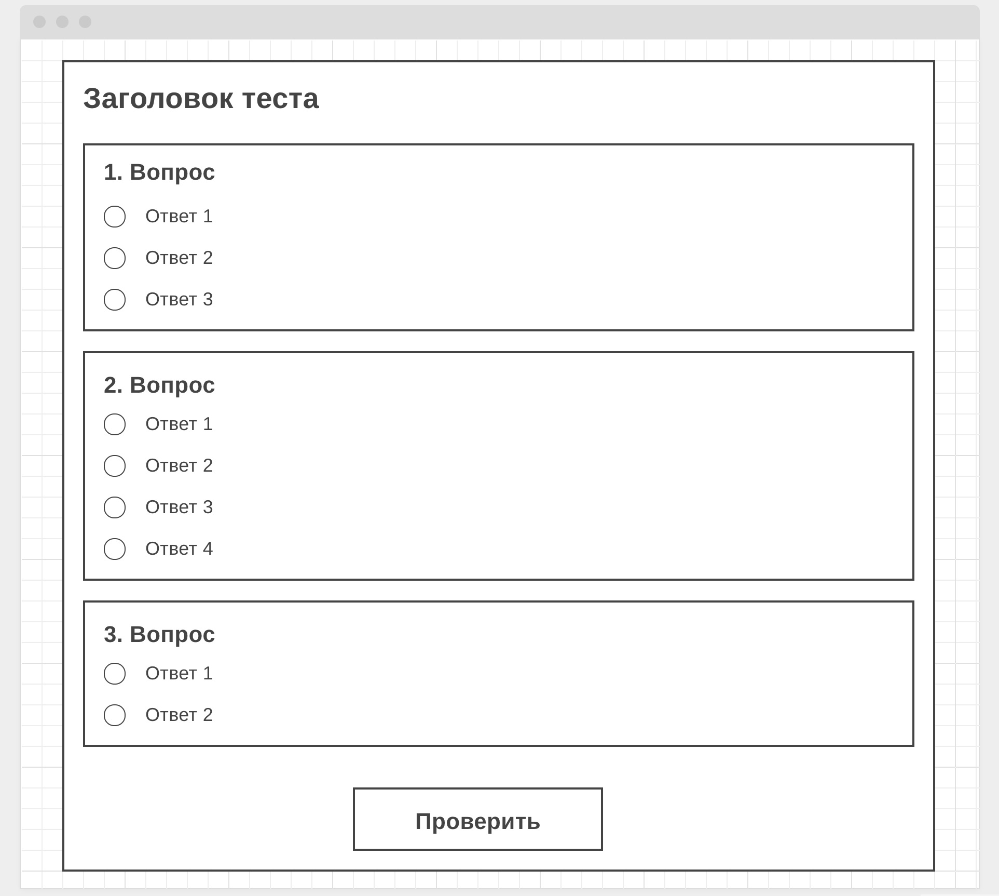

# Критерии приема

- Создан репозиторий `goit-js-hw-07-quiz`
- При сдаче домашней работы есть две ссылки: на исходные файлы и рабочую
  страницу на GitHub pages
- Задание выполнено строго по ТЗ
- При посещении рабочей страницы (GitHub pages) задания, в консоли нету ошибок и
  предупреждений
- Имена переменных и функций понятные, описательные
- Код отформатирован с помощью Prettier
- Для стилизации достаточно позиционирование и внешний вид приближенный к
  макету. Выделяй 20% времени на стили и 80% на функционал.

## Задание

Создай форму вопросника с возможностью пройти тест. Каждый вопрос это секция
формы, где ответы представлены группой радиокнопок.



Заголовок теста и набор вопросов находятся в объекте, экспортируемом из файла
[quiz-data.js](./quiz-data.js). Каждый вопрос представлен объектом со следующими
свойствами.

- `question` - текст вопроса
- `choices` - массив ответов
- `answer` - индекс правильного ответа из массива `choices`

Необходимо динамически создать разметку формы по этим данным используя
`document.createElement()` или шаблонные строки. Каркас формы и кнопка
`Проверить` изначально есть в HTML-документе.

При сабмите формы проверь на сколько вопросов пользователь ответил верно и
выведи (можно под формой) сообщение об успехе или неудаче. Успешным прохождение
теста считается при `80%` или более верных ответов.

## HTML-разметка

Начальная разметка в HTML-документе.

```html
<form>
  <button type="submit">Проверить</button>
</form>
```

Каждый вопрос представлен следующей HTML-разметкой. Текст вопроса и количество
вариантов ответов зависит от данных вопроса. Подумай что подставить в атрибуты
`name` и `value` радиокнопок.

```html
<section>
  <h3>1. Текст вопроса</h3>

  <ol>
    <li>
      <label>
        <input type="radio" name="" value="" />
        Ответ 1
      </label>
    </li>
    <li>
      <label>
        <input type="radio" name="" value="" />
        Ответ 2
      </label>
    </li>
  </ol>
</section>
```
