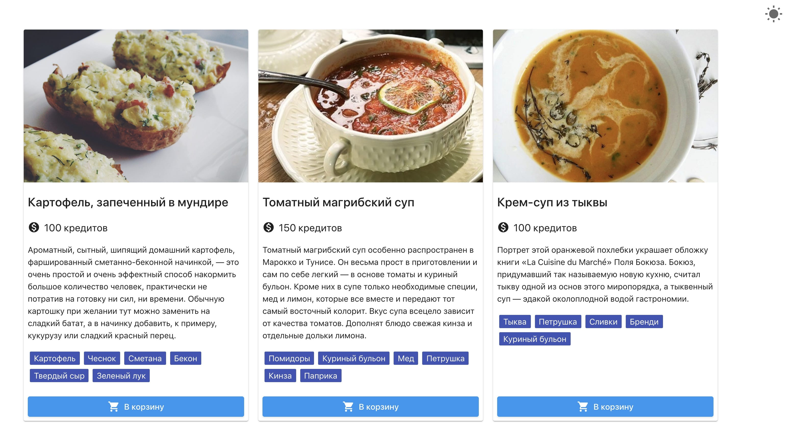

**Читать на других языках: [Русский](README.md), [Українська](README.ua.md).**

# Критерії прийому

- Створено репозиторій `goit-js-hw-10-food-service`.
- При здачі домашньої роботи є два посилання: на вихідні файли і робочу сторінку
  на GitHub pages.
- При відвідуванні робочої сторінки (GitHub pages) завдання, в консолі немає
  помилок і попереджень.
- Імена змінних та функцій зрозумілі, описові.
- Проєкт зібраний з допомогою `Parcel`.
- Код відформатований за допомогою `Prettier`.

# Завдання

Створи сторінку меню з можливістю вибору теми для сервісу замовлення їжі.
[Посилання на демо відео](https://take.ms/RxIlv).



- Обов'язково використовуй
  [parcel-project-template](https://github.com/goitacademy/parcel-project-template)
  для збирання та деплоя проекта.
- В папці [src](./src) ти знайдеш стартову розмітку, стилі і дані
- Масив об'єктів страв лежить в [menu.json](./src/menu.json)

## Тема

Реалізуй функціонал зміни теми при натисканні (подія `change`) на чекбокс
`#theme-switch-toggle` в тулбарі.

- За замовчуванням тема світла.
- При зміні теми, необхідно додавати на елемент `body` клас `light-theme` або
  `dark-theme`.
- Обрана тема повинна зберігатися між перезавантаженнями сторінки. Для
  зберігання   активної теми використовуй localStorage.
- Якщо при завантаженні сторінки тема темна, не забудь поставити властивість
  `checked` у чекбокса `#theme-switch-toggle` в `true`, щоб повзунок зрушився в
     правильне положення.

Для зручності зберігання списку тем використовуй таке перерахування `Theme`.

```js
const Theme = {
  LIGHT: 'light-theme',
  DARK: 'dark-theme',
};
```

## Шаблонізація

Використовуючи шаблонізатор [Handlebars](https://handlebarsjs.com/) створи
шаблон одного елемента меню. Після чого, використовуючи шаблон, створи розмітку
всього меню за даними з [menu.json](./src/menu.json) і додай в DOM в
`ul.js-menu`.

Для іконок використовуємо `Material Icons`, лінк на веб-фонт вже є в вихідному
HTML.

Нижче вказана розмітка елемента меню яка повинна виходити за шаблоном (дані
будуть різні для кожного об'єкта).

```html
<li class="menu__item">
  <div class="card">
    
    <div class="card__content">
      <h2 class="card__name">Картопля, запечена в мундирі</h2>
      <p class="card__price">
        <i class="material-icons"> monetization_on </i>
        100 кредитів
      </p>

      <p class="card__descr">
        Ароматна, ситна, шипляча домашня картопля, фарширована сметанно-беконною
        начинкою, - це дуже простий і дуже ефектний спосіб нагодувати велику
        кількість людей, практично не витративши на підготовку ні сил, ні часу.
        Звичайну картоплю при бажанні тут можна замінити на солодкий батат, а в
        начинку додати, наприклад, кукурудзу або солодкий червоний перець.
      </p>

      <ul class="tag-list">
        <li class="tag-list__item">Картопля</li>
        <li class="tag-list__item">Часник</li>
        <li class="tag-list__item">Сметана</li>
        <li class="tag-list__item">Бекон</li>
        <li class="tag-list__item">Твердий сир</li>
        <li class="tag-list__item">Зелена цибуля</li>
      </ul>
    </div>

    <button class="card__button button">
      <i class="material-icons button__icon"> shopping_cart </i>
      В корзину
    </button>
  </div>
</li>
```
