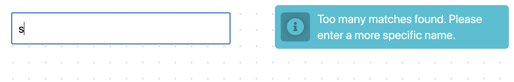

**Read in other languages: [Русский](README.md), [Українська](README.ua.md), [English](README.en.md), [Español](README.es.md), [Polski](README.pl.md).**

# Acceptance criteria

- `goit-js-hw-10` repository created.
- In your submitted homework, there are two links: One to your source files and one to your working page on `GitHub Pages`.
- During live page visits, there are no errors or warnings generated in the console.
- Project built with [parcel-project-template](https://github.com/goitacademy/parcel-project-template).
- Code formatted with `Prettier`.

## Start files

In the [src folder](./src), you will find start files. Copy them to your project completely, replacing the `src` folder in [parcel-project-template](https://github.com/goitacademy/parcel-project-template). To do this, download this entire repository as an archive or use the [DownGit service](https://downgit.github.io/) to download a separate folder from the repository.

## Task - country search

Create a front-end part of the application to search for information about countries by their partial or full names. Check out the [demo video](https://user-images.githubusercontent.com/17479434/131147741-7700e8c5-8744-4eea-8a8e-1c3d4635248a.mp4) of the app.

### HTTP requests

Use the public API [Rest Countries](https://restcountries.com/), namely [resource name](https://restcountries.com/#api-endpoints-v3-name), which returns an array of country objects that match the search criteria. Add at least some decoration to the interface elements.

Write a function, `fetchCountries(name)`, that makes an HTTP request to [resource name](https://restcountries.com/#api-endpoints-v3-name) and returns a promise with an array of countries - the result of your request. Move it to a separate file called `fetchCountries.js` and make a named export.

### Field filtering

The back-end returns objects with some properties most of which you do not need. To reduce the amount of data transferred, add a string of request parameters - this is how this back-end implements field filtering. Check out the [filter syntax documentation](https://restcountries.com/#filter-response).

You only need the following properties:

- `name.official` - full name of the country
- `capital` - capital
- `population` - population
- `flags.svg` - link to flag images
- `languages` - array of languages

### Search box

The user enters the name of the country to search for in the `input#search-box` text field. HTTP requests are made by typing the country name, that is, on the `input` event. However, you cannot make a request every time a key is pressed, since many requests will be made at the same time, and they will be executed in an unpredictable order.

It is necessary to use the `Debounce` technique on the event handler and make an HTTP request `300ms` after the user has stopped typing text. Use the [lodash.debounce](https://www.npmjs.com/package/lodash.debounce) package.

If the user clears the search box completely, the HTTP request is not executed, and the country list markup or country information disappears.

Sanitize the entered line using the `trim()` method, which will solve the problem when there are only spaces in the input field or at the beginning/end of the line.

### Interface

If the back-end returns more than 10 countries, a notification appears in the interface saying that the name should be more specific. For notifications, use the [notiflix library](https://github.com/notiflix/Notiflix#readme) and display this line: `"Too many matches found. Please enter a more specific name."`.

If the back-end returns from 2 to 10 countries, a list of found countries is displayed under the text field. Each list item consists of a flag and country name.

If the request results in an array with one country, the interface displays the card markup with information about the country: flag, name, capital, population and languages.

> ⚠️ It is enough for the app to work for most countries. Some countries, such as `Sudan`, can be problematic because the name of the country is part of the name of another country, `South Sudan`. Do not worry about these exceptions.

## Error handling

If the user enters the name of a country that does not exist, the back-end will return not an empty array, but an error with the status code `404` - not found. If you do not handle this, the user will never know that the search has not returned any results. Add a notification, "Oops, there is no country with that name"`, in case of an error using the [notiflix library](https://github.com/notiflix/Notiflix#readme).

> ⚠️ Remember that `fetch` does not treat 404 as an error, so you need to explicitly reject the promise in order to catch and handle the error.
