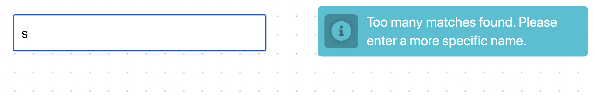
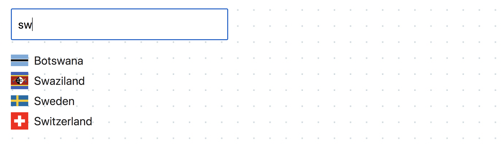
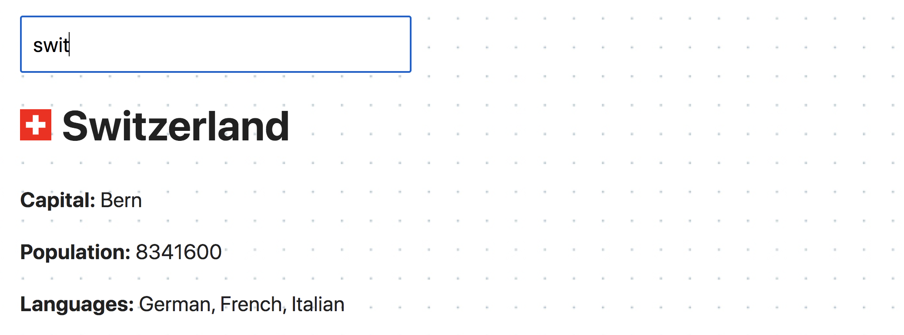
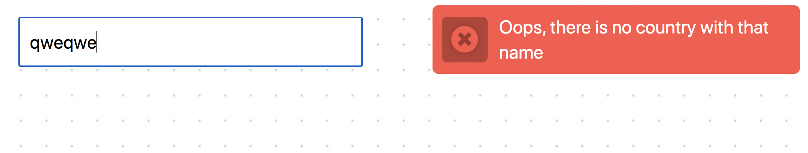

**Read in other languages: [Русский](README.md), [Українська](README.ua.md),
[English](README.en.md), [Español](README.es.md), [Polski](README.pl.md).**

# Criterios de admisión

- Se ha creado el repositorio `goit-js-hw-10`.
- Al entregar las tareas, existen dos enlaces: a los archivos de origen y el trabajo 
  en la página de `GitHub Pages`.
- Al visitar la página de trabajos en vivo, no hay errores ni advertencias en la consola.
- El proyecto está construido con la ayuda de
  [parcel-project-template](https://github.com/goitacademy/parcel-project-template).
- El código es formateado por `Prettier`.

## Archivos de inicio

En la [carpeta src](./src)  encontrará los archivos de inicio. Cópielos en su proyecto,
reemplazando completamente la carpeta `src` en
[parcel-project-template](https://github.com/goitacademy/parcel-project-template).
Para eso, descargue todo el repositorio como un archivo o use el
[servicio DownGit](https://downgit.github.io/) para descargar una carpeta individual del
repositorio.

## Tarea - búsqueda de países

Cree la parte del frontend de una aplicación de búsqueda sobre los datos de países por su parte o el
nombre completo. Mire en
[vídeo demo](https://user-images.githubusercontent.com/17479434/131147741-7700e8c5-8744-4eea-8a8e-1c3d4635248a.mp4)
aplicaciones.

### Consultas HTTP

Use la API pública [Rest Countries](https://restcountries.com/), es decir
[resource name](https://restcountries.com/#api-endpoints-v3-name), que devuelve
el array de los objetos de los países que cumplen los criterios de búsqueda. Añada un diseño
mínimo a los elementos de la interfaz.

Escriba la función `fetchCountries(name)` a cual hace una petición HTTP a
[ресурс name](https://restcountries.com/#api-endpoints-v3-name) y devuelve
promise con el array de los países, el resultado de la consulta. Colóquelo en un archivo separado
`fetchCountries.js` y haga una exportación con nombre.

### Filtración de ámbitos

La respuesta del backend devuelve objetos, la mayoría de los cuales no
 Para poder reducir la cantidad de datos transferidos, añada una secuencia de parámetros
de consulta, así como este backend implementa el filtrado de los ámbitos. Heche un vistazo a la
[documentación de la sintaxis del filtro](https://restcountries.com/#filter-response).

Sólo necesita las siguientes propiedades:

- `name.official` - nombre completo del país
- `capital` - capital
- `population` - población
- `flags.svg` - enlace a la imagen de la bandera
- `languages` - array de idiomas

### Ámbitos de búsqueda

El nombre del país a buscar es introducido por el usuario en la casilla de texto
`input#search-box`. Las consultas HTTP se realizan cuando se escribe el nombre del país, es decir, 
mediante el evento `input`. Pero no puede hacer una consulta cada vez que pulse la tecla
porque habrá muchas consultas a la vez y se ejecutarán en un orden 
imprevisible.

Debe aplicar un truco `Debounce` en el manejador de eventos y hacer
una petición HTTP `300ms después de que el usuario haya dejado de escribir.
Use el paquete
[lodash.debounce](https://www.npmjs.com/package/lodash.debounce).

Si el usuario borra completamente el campo de búsqueda, no se realiza ninguna petición HTTP,
y se elimina la marca del listado de países o la información del país.

Desinfecta la secuencia introducida usando el método `trim()`, esto resolverá el problema si el
ámbito de entrada sólo tiene espacios o si tiene espacios al principio y al final de la secuencia.

### Interfaz

Si el backend devuelve más de 10 países en la respuesta, la interfaz mostrará la
notificación de que el nombre debe ser más específico. Para las notificaciones
use [la biblioteca notiflix](https://github.com/notiflix/Notiflix#readme) y
la emisión de una secuencia como esta.
`"Too many matches found. Please enter a more specific name."`.

Si el backend ha devuelto entre 2 y 10 países, se muestra una lista de 
los países encontrados. Cada elemento de la lista consta de una bandera y un nombre de país

Si el resultado de la consulta es un array con un país, la interfaz muestra un
diseño de tarjeta con los datos del país: bandera, nombre, capital, población e 
idiomas.

> ⚠️ Suficiente para que la aplicación funcione en la mayoría de los países. Algunos
> de los países, como `Sudán', puede causar problemas ya que el nombre del país
> es parte del nombre de otro país, "Sudán del Sur". No tiene que preocuparse por
> estas excepciones.

### Manejo de errores

Si el usuario introduce un nombre de país que no existe, el backend no devolverá un array vacío 
sino un error con el código de estado `404`, no encontrado.  Si esto no se gestiona, el 
usuario nunca sabrá que la búsqueda ha fallado. Añada un
un aviso `"Oops, there is no country with that name"` en caso de que se produzca un error 
al usar a [la biblioteca notiflix](https://github.com/notiflix/Notiflix#readme).

> ⚠️ Tenga en cuenta que `fetch` no se considera como un error 404, por lo que debe
> rechazar explícitamente la promise para que el error pueda ser capturado y manejado.
