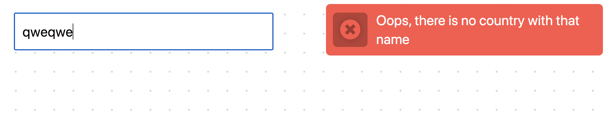

**Read in other languages: [Русский](README.md), [Українська](README.ua.md),
[English](README.en.md), [Español](README.es.md), [Polski](README.pl.md).**

# Kryteria przyjęcia

- Utworzono repozytorium `goit-js-hw-10`.
- Przy oddaniu pracy domowej dołączono linki: do plików źródłowych i strony
  roboczej na `GitHub Pages`.
- Wiersz poleceń nie zawiera błędów i ostrzeżeń.
- Projekt utworzono z pomocą
  [parcel-project-template](https://github.com/goitacademy/parcel-project-template).
- Sformatowano kod `Prettier`.

## Pliki startowe

W [folderze src](./src) znajdziesz pliki startowe. Skopiuj je do swojego
projektu, całkowicie zamieniając folder `src` w
[parcel-project-template](https://github.com/goitacademy/parcel-project-template).
Aby to zrobić, pobierz całe repozytorium jako archiwum lub użyj
[serwisu DownGit](https://downgit.github.io/) aby pobrać oddzielny folder z
repozytorium.

## Zadanie - wyszukiwanie krajów

Utwórz frontend aplikacji wyszukiwania danych o kraju według częściowej lub
pełnej nazwy.

https://user-images.githubusercontent.com/17479434/131147741-7700e8c5-8744-4eea-8a8e-1c3d4635248a.mp4

### Żądanie HTTP

Użyj publicznego API [Rest Countries v2](https://restcountries.com/), a
dokładniej [nazwa źródła](https://restcountries.com/#api-endpoints-v3-name),
który przekazuje tablicę obiektów krajów odpowiadających kryteriom wyszukiwania.
Popraw wizualnie elementy interfejsu.

Napisz funkcję `fetchCountries(name)` która tworzy żądanie HTTP na
[nazwa źródła](https://restcountries.com/#api-endpoints-v3-name) i przekazuje
obietnicę z tablicą krajów - wynikiem żądania. Przenieś ją do oddzielnego pliku
`fetchCountries.js` i utwórz eksport nazwany.

### Filtrowanie pól

W odpowiedzi, z backendu przekazywane są obiekty, których większość właściwości
nie przyda Ci się. Aby zredukować zakres przekazywanych danych, dodaj ciąg
parametrów żądania - w taki sposób backend realizuje filtrację pól. Zapoznaj się
z [dokumentacją składni filtrów](https://restcountries.com/#filter-response).

Potrzebujesz tylko następujących właściwości:

- `name.official` - pełna nazwa kraju
- `capital` - stolica
- `population` - liczba ludności
- `flags.svg` - link do ilustracji przedstawiającej flagę
- `languages` - tablica języków

### Pole wyszukiwania

Nazwę kraju, którą chce wyszukać użytkownik, wprowadza się w pole tekstowe
`input#search-box`. Żądania HTTP realizuje się przy komplecie nazw krajów, czyli
po zdarzeniu `input`. Jednak nie należy spełniać żądania po każdym kliknięciu
przycisku, ponieważ otrzymamy jednocześnie wiele żądań, które zostaną spełnione
w nieprzewidywalnym porządku.

Koniecznym jest zastosowanie funkcji `Debounce` na event handler i wykonanie
żądania HTTP `300ms` po tym, jak użytkownik przestał wprowadzać tekst. Użyj
pakietu [lodash.debounce](https://www.npmjs.com/package/lodash.debounce).

Jeśli użytkownik całkowicie usuwa pole wyszukiwania, to żądanie HTTP nie zostaje
zrealizowane, a znacznik listy krajów lub informacji o kraju znika.

Dokonaj sanityzacji wprowadzonego ciągu metodą `trim()`, to rozwiąże problem,
gdy w polu wprowadzania są tylko spacje lub widnieją one na początku i na końcu
wiersza.

### Interfejs

Jeśli w odpowiedzi backend przekazał więcej niż 10 krajów, w interfejsie pojawia
się powiadomienie o tym, że nazwa powinna być bardziej specyficzna. Do
powiadomień używaj
[biblioteki notiflix](https://github.com/notiflix/Notiflix#readme) i wprowadź
taki wiersz `"Too many matches found. Please enter a more specific name."`.

Jeśli backend przekazał od 2-óch do 10-ciu krajów, pod polem tekstowym pojawia
się lista znalezionych krajów. Każdy element listy składa się z flagi i nazwy
kraju.

Jeśli wynik żądania to tablica z jednym krajem, w interfejsie pojawia się
znacznik karty z danymi o kraju: flaga, nazwa, stolica, liczba ludności i
języki.

> ⚠️ Wystarczy, jeśli aplikacja będzie działała dla większości krajów. Niektóre
> kraje, takie jak `Sudan`, mogą powodować problemy, ponieważ nazwa kraju jest
> częścią nazwy innego kraju, `South Sudan`. Nie należy się skupiać na tych
> wyjątkach.

### Przetwarzanie błędu

Jeśli użytkownik wprowadził nazwę kraju, który nie istnieje, backend przekaże
nie pustą tablicę, a błąd z kodem stanu `404` - nie znaleziono. Jeśli tego nie
opracujesz, to użytkownik nigdy nie dowie się o tym, że żądanie nie przyniosło
wyników. Dodaj powiadomienie `"Oops, there is no country with that name"` w
razie błędu, używając
[biblioteki notiflix](https://github.com/notiflix/Notiflix#readme).

> ⚠️ Nie zapominaj o tym, że `fetch` nie postrzega 404 jako błędu, dlatego
> konieczne jest widoczne odrzucenie obietnicy, aby można było wyłapać i
> przetworzyć błąd.
